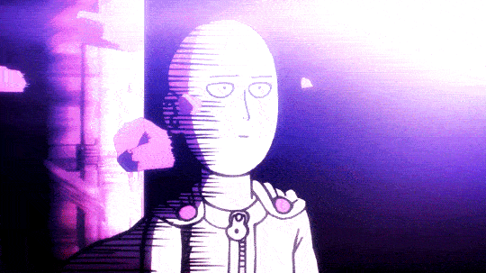

  

<h1 align="center"> Hi, I'm Danya</h1>
<h3 align="center">I'm a frontend developer currently looking for new oportunities</h3>

 

<h2 align="center">🤖 Languages and Tools 🤖</h2>

    
     
    

    	
    	
    	
    	
    	
    	
    	
    	
    	
    	
    	
    	
    	
    	
    	
    	
    	
    	
    	
    	
    	
    	
    	
    

     

<h2 align="center">📄 Check out my CV 📄</h2>

    
    

        <a href="https://drive.google.com/file/d/1zNXnggXMbF8CkqTXFJQyAgnHcbn4WulU/view?usp=sharing" target="blank">
             
            
             
        </a>
    

<h2 align="center">👨‍💻 CodeWars 👨‍💻</h2>

    
         
    

    
    

        

<h2 align="center">🕺 Thanks for visiting 💃</h2>

    

